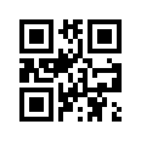

## Lab Assignment: Object Sorting with 6-DOF WLKATA Robot Arm and Camera

**Objective:**
In this lab, students will program a 6-degree-of-freedom (6-DOF) WLKATA robot arm equipped with a camera to scan QR codes on objects and sort them into designated areas based on their QR code labels.

**Group Assignment:**

Submit your results as a group on Canvas. Ensure everyone's names are included in the submission.

# Update!!!
Use cam_arm_demo.py as a template for this assignment. This file is a simple script that will:
- home the robot arm
- scan a qr code
- move the robot arm (forward kinematics i.e. set the joint angles)
- move the robot arm (inverse kinematics i.e. set the pose in 3D space)

**Equipment Needed:**
- 6-DOF WLKATA Robot Arm
- Camera (OAK-D Lite or equivalent)
- Objects with QR codes labeled as either "engine" or "gearbox"
- Designated sorting areas (Area 1 and Area 2)

## Part I - QR Code Scanner

### Instructions:

1. **Setup:**
   - Connect the WLKATA robot arm to your computer and ensure the control software is running.
   - Position the camera to clearly capture the QR codes of objects in the designated scanning area.
   - Ensure the sorting areas (Area 1 and Area 2) are clearly marked.

2. **QR Code Scanning:**
   - Use the provided Python script to capture frames from the camera and detect QR codes.
   - Extract and interpret the QR code data.

3. **Object Classification:**
   - If the QR code reads "engine," program the robot arm to pick up the object and place it in Area 1.
   - If the QR code reads "gearbox," program the robot arm to pick up the object and place it in Area 2.
   - If no QR code is detected, keep the object in the scanning area for re-evaluation.

4. **Robot Arm Control:**
   - Use the wlkata_controller.py code to command the robot arm to grasp, move, and release the objects accurately.
   - Ensure smooth movements and avoid collisions.

5. **Testing and Demonstration:**
   - Place test objects with QR codes in the scanning area.
   - Run the program and observe the robot sorting the objects correctly.
   - Adjust positioning or parameters if needed to improve accuracy.

6. **Documentation:**
   - Record observations, including any misclassifications or issues encountered.
   - Propose improvements for future implementations.

**Evaluation Criteria:**
- Successful identification of QR codes.
- Accurate sorting of objects into designated areas.
- Proper and efficient use of the WLKATA robot arm.
- Clear and structured documentation of the process and findings.

## Part II - Sorting by Colour
### **Instructions for Color-Based Sorting:**

1. **Setup:**
   - Position the camera to clearly capture the color of objects placed in the scanning area.
   - Define color thresholds (e.g., HSV or RGB values) to distinguish different object colors.

2. **Color Detection:**
   - Capture an image of the object using the camera.
   - Process the image to identify the dominant color using OpenCV.
   - Classify the object based on its detected color.

3. **Object Classification:**
   - If the object is red, move it to Area 1.
   - If the object is blue, move it to Area 2.
   - If the color is unclear, keep the object in the scanning area for re-evaluation.

4. **Robot Arm Control:**
   - Use the wlkata_controller.py code to program the arm to pick up and move objects based on their detected color.
   - Ensure smooth motion and precise placement.

5. **Testing and Demonstration:**
   - Place test objects of different colors in the scanning area.
   - Run the program and verify if the objects are sorted correctly.
   - Adjust color thresholds if necessary.

6. **Documentation:**
   - Record observations, including any errors in color detection or sorting.
   - Suggest improvements for accuracy and efficiency.

### **Evaluation Criteria:**
- Successful identification of QR codes and/or object colors.
- Accurate sorting of objects into designated areas.
- Proper and efficient use of the WLKATA robot arm.
- Clear and structured documentation of the process and findings.

**Submission**
Submit a report (5-10 pages) detailing your approach, code implementation, observations, and any suggested improvements.

---
Good luck!

